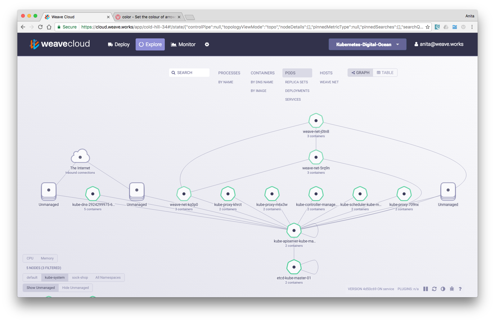

## kube-apiserver
Validate the configuration data for api objects, which include pods, services, replicationcontrollers. Entrt point for REST and cli tools.

## kube-controller-manager
The Kubernetes controller manager is a daemon that embeds the core control loops shipped with Kubernetes. Control loop is a non-terminating loop that regulates the state of the system. In Kubernetes, a controller is a control loop that watches the shared state of the cluster through the apiserver and makes changes attempting to move the current state towards the desired state. Examples of controllers that ship with Kubernetes today are the replication controller, endpoints controller, namespace controller, and serviceaccounts controller.

## kube-proxy
Runs on each node. Forwards requests to dockerized backend found by Docker-links-compatinle environmant variable.

## kube-scheduler
Basically it is managing pods across the whole K8s cluster.

## kubelet
Primary "node agent" that runs on each node. Kubelet works in PodSpec term in Yaml or Json that describes a pod.

## Weave - Software Defined Network
Weave Net creates a virtual network that connects Docker containers across multiple hosts and enables their automatic discovery. With Weave Net, portable microservices-based applications consisting of multiple containers can run anywhere: on one host, multiple hosts or even across cloud providers and data centers. Applications use the network just as if the containers were all plugged into the same network switch, without having to configure port mappings, ambassadors or links.

